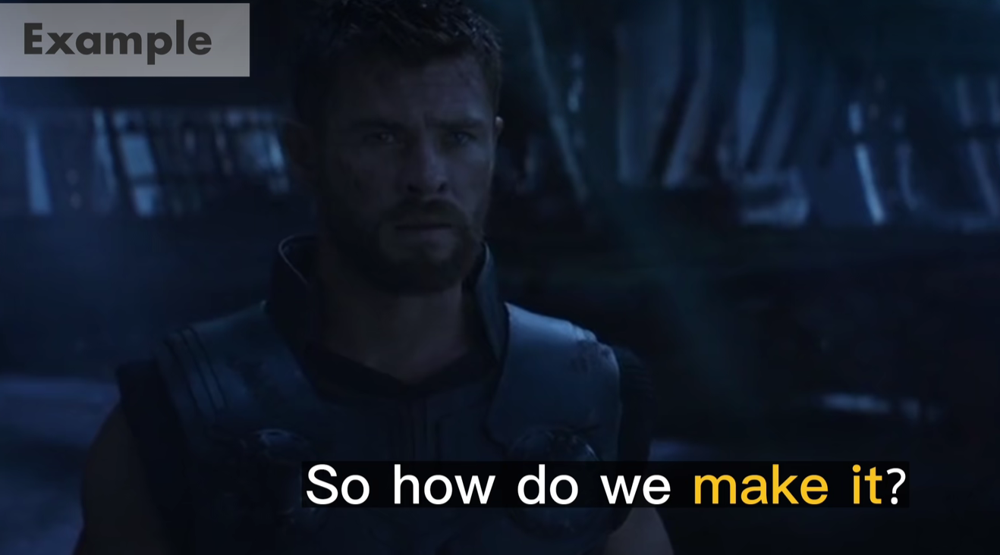

# Pitch Perfect

## Reference

https://www.bilibili.com/video/BV1nk4y1p7mt

## 1. Words or Phrases

**Man:** What, do you not like movies or somethings ?

**Woman:** Like, a movies? You don't ...

**Man:**  What the hell is wrong with you ? How do you not like movies ?

**Woman:** Not liking movies is like not liking `puppies`(宠物). They're fine, I just get bored and
never `make it to the end`.

[//]: # (************************************)

<b>make it to the end</b>

**This phrase means to successfully reach or finish the final part of conclusion of somethind,
such as a movie, book, or event.**

**Example:**

1. I'm not sure if I'll `make it to the end` of the movie.
2. Reading a thousand-page novel can be challenging, but if you're determined, you'll `make it to the end` and enjoy the
   satisfying conclusionS.

<b>make it</b>

**1. To arrive at or `attend`(参加) a `specified`(特定的) event or appointment.**

Example:

1. I have a meeting at 2 p.m, but I'm not sure if I can `make it` on time due to traffic.

**2. To achieve success or `accomplish`(实现) a goal.**

Example:

1. After years of hard work, he finally `made it` as a successful actor in Hollywood.

**3. To survive or recover from a difficult situation.**

Example:

1. `Despite`(尽管) the challenges, she managed to `make it through`(度过) the tough times with the support of her
   friends.

**Example in Movies**

[//]: # (************************************)

**Man:** The endings are the best part.

**Woman:** They're `predictable`. Like, the guy gets the girl, and that kid sees dead people and Darth Vader is Luke's
father.

[//]: # (************************************)

<b>Predictable</b>

**If something is predictable, you know in advance that it will happen or what it will be like.**

Example:

1. The movie's plot was predictable, following the typical `romantic comedy formula`(烂漫戏剧公式) with a predictable
   ending.

**Example in Movies**

[//]: # (*******************************888)

**Man:** Oh, right, so you just happened to guess the biggest `cinematic`(电影) `reveal` in history?

[//]: # (*******************************)

<b>Reveal</b>

**A reveal is the moment when a previously secret piece of information is made known.**

Example:

1. The movie had shocking reveal near the end, where the `true identify`(真实身份) of the `murderer`(凶手) was
   finally `revealed`.

**Example in Movies**

[//]: # (*******************************)

**Woman:** Vader" in German means father. His name is `literally`(字面意思) "Darth Father".

Man: Huh. So, you know German. Well, now I know why you don't like fun things. You know, you need a movie education. And
I'm
gonna give it to you.

**Woman:** Yeah, in between Bella `rehearsals`, which are always.

[//]: # (*******************************)

<b>rehearsals</b>

**A rehearsal is the time that is spent practicing a play or piece of music in preparation for a public performance.**

Example:

1. The band had several `rehearsals` to ensure that they played their songs `flawlessly`(完美地) during the `concert`(
   音乐会).
2. During the dance `rehearsal`, the `choreographer`(编舞者) provided feedback and made adjustments to improve the
   `overall`(整体的) performance.

Example in Movies:

[//]: # (*******************************)

**Man:** Are you guys getting ready for the `riff-off`(即兴表演)?

**Woman:** What the hell is a riff-off?

***

## 2. Overall Content

**Man:** What, do you not like movies or somethings?

**Woman:** Like, a movies? You don't ...

**Man:**  What the hell is wrong with you ? How do you not like movies ?

**Woman:** Not liking movies is like not liking `puppies`(宠物). They're fine, I just get bored and
never `make it to the end`.

**Man:** The endings are the best part.

**Woman:** They're `predictable`. Like, the guy gets the girl, and that kid sees dead people and Darth Vader is Luke's
father.

**Man:** Oh, right, so you just happened to guess the biggest `cinematic`(电影) `reveal` in history?

**Woman:** Vader" in German means father. His name is `literally`(字面意思) "Darth Father".

**Man:** Huh. So, you know German. Well, now I know why you don't like fun things. You know, you need a movie education.
And
I'm gonna give it to you.

**Woman:** Yeah, in between Bella `rehearsals`, which are always.

**Man:** Are you guys getting ready for the `riff-off`(即兴表演)?

**Woman:** What the hell is a riff-off?
